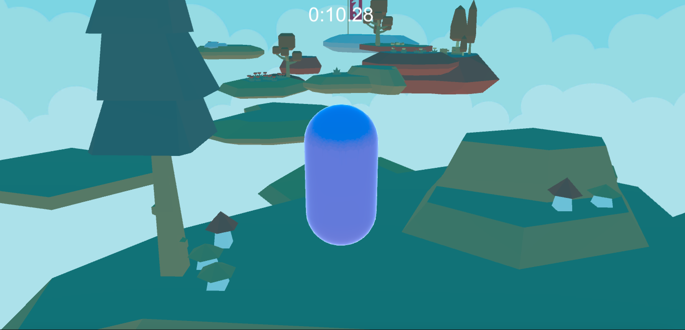

# 0x05 Unity - Assets: Models, Textures

This directory contains the beginning of a platformer game that is finished in [0x08-unity-audio](../0x08-unity-audio). In this project, I planned out an overview of platformer placement, scripted a capsule to move with user input, and scripted the camera to move based on the mouse position. 

## Learning Objectives
- What is an Asset and how to import and use them
- How to use Asset Packages and the Unity Asset Store
- What are common Asset types
- How to use Unity primitives as placeholders to prototype a project
- What are materials and how to use them
- What are textures and how to use them
- What is a skybox
- What is are the components of a 3D model
- What is a mesh
- How to create UI elements with image components
- What is a Rigidbody and what is a Character Controller and what are the pros and cons of using each
- What is a Quaternion

## Assets
- Skyboxes: [Farland Skies - Cloudy Crown](https://assetstore.unity.com/packages/2d/textures-materials/sky/farland-skies-cloudy-crown-60004)
- Models: [Kenney's Nature Pack Extended](https://kenney.nl/assets/nature-pack-extended)
