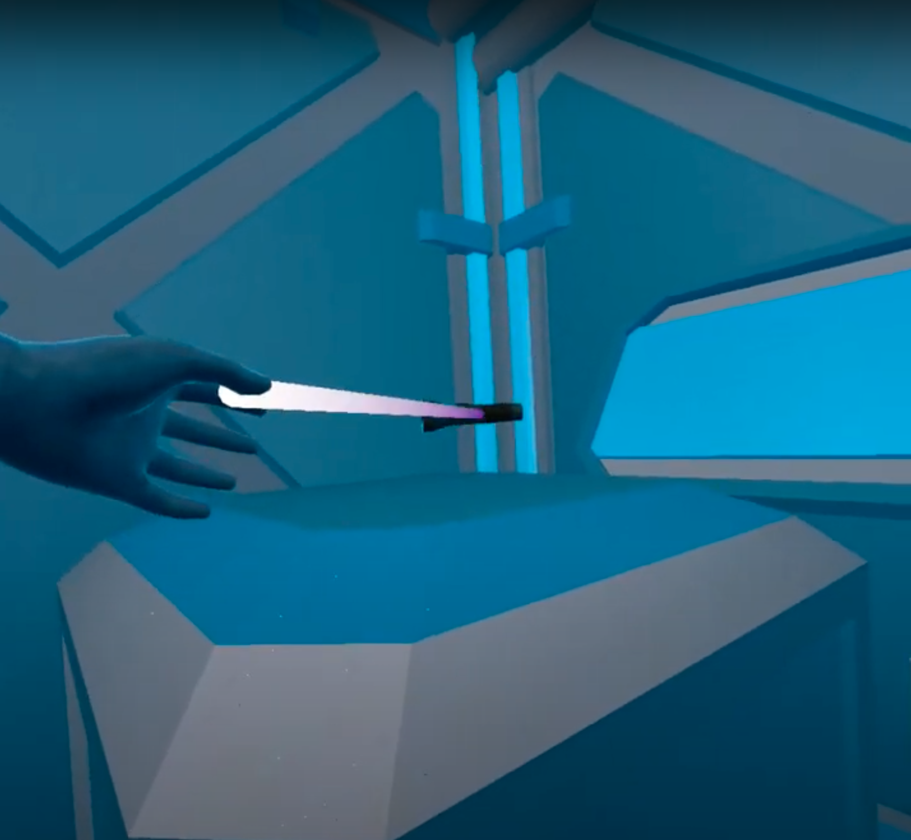

# Unity: VR Room

## Table of Contents
- [Unity: VR Room](#unity-vr-room)
  - [Table of Contents](#table-of-contents)
  - [About](#about)
  - [Make it accessible](#make-it-accessible)
  - [References](#references)

## About
This directory contains files for a VR escape room. A development journal for this project can be found [here](Progress_log.md).

## Make it accessible
Once the basics are complete, try to:
- [ ] Create sound cues for interactable objects
- [ ] Check for color cues. Are they color blind safe colors?
- [ ] Raycast continually flashing between valid and nonvalid is nausiating. Figure out what's going on with it.

## References
Videos I used as tutorials
- [UNITY XR INTERACTION TUTORIAL PART 6: Using the Interactable Events](https://www.youtube.com/watch?v=KcSGf2DKQhU&ab_channel=DanielStringer)
- [Introduction to VR in Unity - PART 1 : VR SETUP](https://www.youtube.com/watch?v=gGYtahQjmWQ&ab_channel=Valem)
  - Getting hand grab working
- [Introduction to VR in Unity - PART 2 : INPUT and HAND PRESENCE](https://www.youtube.com/watch?v=VdT0zMcggTQ&ab_channel=Valem)
  - Getting hand animation working correctly
