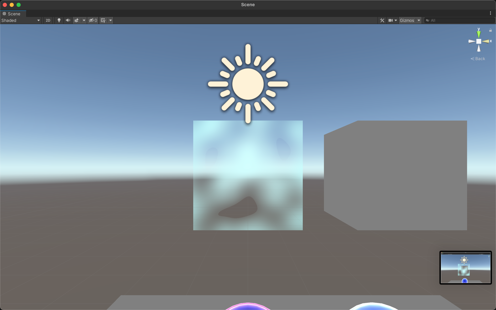

# Task Notes
## 0 - Glow
### Resources
- YouTube: [Unity tutorial](https://youtu.be/qTYOWRWuBQg)
## 1 - Animated Glow
### Resources
- Youtube: [Unity SHADERGRAPH Episode 7: Time](https://youtu.be/2fg8fdkS4Nw)
### Steps
- Began with base of Glow shader graph
- Creating pulse
  - Add time node to use sine time. This has a range from -1 to 1
- Setting max and min
  - Take input from min and max and put them into a vector 2 node.
  - Create remap node with sin as input.
  - Take vector 2 with min and max and use the output for the output range for remap node.
  - Set input range to -1 and 1, since that's the range of sine
  - Remap output becomes power of fresnal effect
- Setting pulse frequency
  - Create pulse speed property.
  - Output time (just time) and pulse speed into new multiply node.
  - Output multiply node into new sine node.
  - Use sine node output as remap's input
## 2 - Dissolve
### Resources
- YouTube: [DISSOLVE using Unity Shader Graph](https://youtu.be/taMp1g1pBeE)
### Steps
- Create simple noise for Alpha.
- Create scale property. Set default to 30 and use this for simple noise scale.
- Edit the [alpha clip](https://docs.unity3d.com/Packages/com.unity.render-pipelines.high-definition@7.1/manual/Alpha-Clipping.html) to control the speed.
  - Create speed property. Set default to .1
  - Create time node.
  - Create multiply node to multiply time by speed.
  - Output multiply to alpha clip threshold.
## 3 - Ice
Since I now have a basic understanding of shader graphs, I'm going to try this on my own before I look up any tutorials.
### My version

- Create gradient noise and set the scale to 2.
- Output gradient noise to alpha.
- Set alpha clip threshold to 0.
- Graph should be lit with a transparent surface.
### Resources
- YouTube: [Unity Shader Graph - Ice Tutorial](https://youtu.be/Gym5JWHgjkk)
## 4 - Hologram
### First Attempt
- [Shader Graph Tutorials: Hologram Shader](https://www.codinblack.com/shader-graph-tutorials-hologram-shader/)
- Following the Hologram Shader tutorial above, I created a scrolling affect. However, I don't like the way this looks. In our example, the texture is supposed to flicker. In the one I created, it scrolls. Need to rework.
### Second Attempt
- [Holograms in Unity Shader Graph](https://youtu.be/wtZ5WcrV-9A)
- Following instructions from tutorial, which is a simplified version of the first attempt.
- I definitely like the lack of flashing.
- Modified it so that only the fresnel + color in emission becuase no colors would show if I used the fresnel + texture.
## Misc. Notes
- Organization
  - To group items, highlight nodes and ctrl+g. This will prompt you for a name for group.