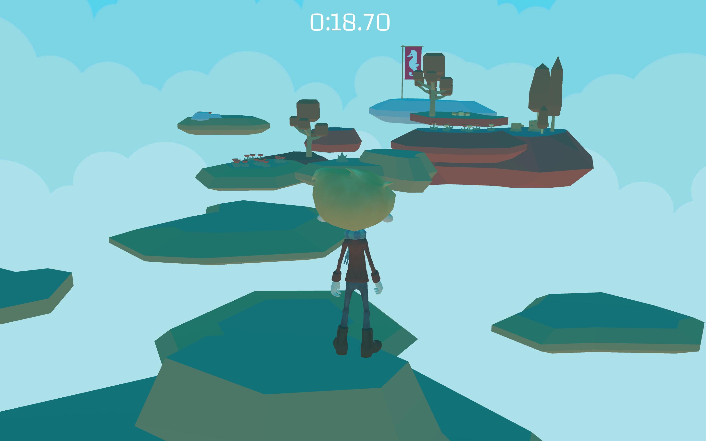

# holbertonschool-unity
This repository contains practice projects for learning Unity. Files range from simple text answers to key components of the software to a virtual reality escape room.

## Current Goals
1. Creating sample shader graphs
2. Creating an augmented reality slingshot game
3. Reviewing old projects and tracking [accessibility issues](https://github.com/aleiadevore/holbertonschool-unity/projects/1)
4. Updating READMEs for individual projects

## Projects
### Unity Concepts
- **[Unity User Interface](https://github.com/aleiadevore/holbertonschool-unity/tree/main/0x00-unity-user_interface)** - text answers for learning how to use the Unity interface
- **[Unity Concepts](https://github.com/aleiadevore/holbertonschool-unity/tree/main/0x01-unity_concepts)** - Basic scene practice, creating prefabs
- **[Unity Publishing](https://github.com/aleiadevore/holbertonschool-unity/tree/main/0x04-unity_publishing)** - A simple maze game, implementing scripts and UI elements
### Platformer Game

- **[Assets, Models, Textures](https://github.com/aleiadevore/holbertonschool-unity/tree/main/0x05-unity-assets_models_textures)** - Beginning of platformer game
- **[3rd Person Copy](https://github.com/aleiadevore/holbertonschool-unity/tree/main/0x05-3rd_person_copy)** - Same project as Assets, Models, Textures recreated using the Unity Third Person Character Controller
- **[Assets, UI](https://github.com/aleiadevore/holbertonschool-unity/tree/main/0x06-unity-assets_ui)** - Building on Assets, Models, Textures, this project adds in a main menu, options menu, and pause menu.
- **[Animation](https://github.com/aleiadevore/holbertonschool-unity/tree/main/0x07-unity-animation)** - Building on Assets, UI, this project creates an animated character model
- **[Final Platformer Game](https://github.com/aleiadevore/holbertonschool-unity/tree/main/0x08-unity-audio)** - Building on Unity Animation, this project creates audio for the platformer game
### Augmented Reality

- **[AR Business Card](https://github.com/aleiadevore/holbertonschool-unity/tree/main/0x09-unity_ar_business_card)** - An augmented reality business card!
### Virtual Reality
- **[360 Video](https://github.com/aleiadevore/holbertonschool-unity/tree/main/0x0A-unity-360_video_tour)** - A 360 degree video tour built for Oculus Quest
- **[VR Escape Room](https://github.com/aleiadevore/holbertonschool-unity/tree/main/0x0B-unity-vr_room)** - Virtual reality escape room for Oculus Quest
